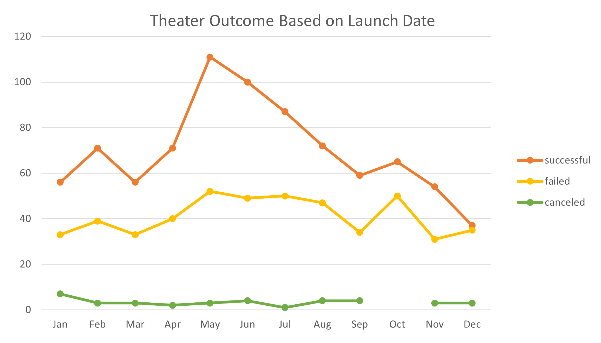
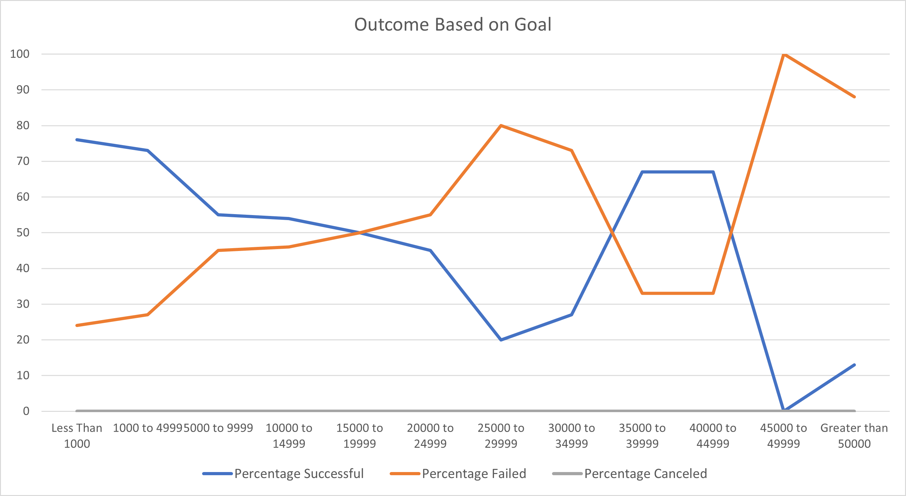

# Kickstarting with Excel

## Overview of Project
Louise wants to raise money to produce a play, *Fever*. She wants to raise $10,000 for the play. This project analyzes data from fundraising campaign from past productions around the world to help Louise make an attainable goal in her fundraising effort. The focus is on the theater production in the US. The data is presented in two different ways with charts: 
1. Outcome Based on Launch Date
2. Outcome Based on Goals

### Purpose
The purpose of this project is to learn different ways to extract and analyze a dataset using an Excel Spreadsheet in a meaningful way. We are given a raw set of data that has 4,115 rows and 12 columns. We learned to manipulate the data to get useful information. Some manipulation we learned included, 
1. Sorting data based on "Outcome".
2. Formatting data in currency, converting a Unix time stamp to a date, filtering data, using text to column. 
3. Using Pivot table and Pivot charts to filter and to focus on a particular subset of data.
4. Using VLOOP to extract data based on certain conditions. 
5. We learned to plot charts and calculate Mean, Median, Upper Quartile, Lower Quartile, IRQ, Standard Deviation to analyze and extract information based on the interest of the client. We also learned Box Plot and Whiskers to locate the concentration of data and pinpont the outliers.

## Analysis and Challenges
We are asked to do two deliverables based on the theater outcomes in the United States. We focused on successful, failed and canceled productions. Our challenge is to extract data from the "Kickstarters" raw datasheet to two new worksheets, (1) Outcomes Based on Launch Date" and (2) Outcome Based on Goals. The summery of each deliverable is given below.

### Analysis of Outcomes Based on Launch Date
For **Deliverable 1**, we focused on the theater outcomes in the US based on the launch dates. We used **Pivot Tables** to import data from the "Kickstarter" sheet and present it in a different sheet, "Theater Outcomes by Launch Date". We filtered data and sorted it in a table that has the ourcomes "successful", "failed" and "canceled" as a function of different months of the year. We plotted a **Pivot Chart**, _Line with Markers_, to plot a chart that is filtered to show the US theater outcome based on months. See **Fig.1**  below.

 <strong> Fig.1 </strong>

### Analysis of Outcomes Based on Goals
For **Deliverable 2** , We analyzed data based on the goals in the fundraising campaign. We extracted data from the "Kickstarter" worksheet and counted the number of "seccessful", "failed" and "canceled" plays in the US based on the fundraising Goals. We evaluated the outcome of plays from all the data, but split it up in $5000 steps in twelve ranges. We used COUNTIFS( ) to import the data from the "kickstarter" worksheet and used different conditions, such as find the number of (1) "successful", (2) "plays", (3) within a range of $10,000 to $14,999. Please see the Excel file included with this report. We present the data, the percent of "successful", "failed" and "canceled" outcomes based on the Goals in a _Line Plot_ as shown in **Fig. 2** below. 

 <Strong> Fig. 2 </strong>

### Challenges and Difficulties Encountered
We extracted data from the "Kickstarter" data sheet and filtered the data, plotted the outcomes based on the instructions given in Canvas. I did not find any difficutly in analyzing the data followng the instructions. We practiced different aspects of data analysis in the earlier part of the module which made these steps straight forwarad.

**Consistency check** : I ran into issues plotting the "Deliverable 2". I wanted to make sure that I was importing the data correctly using COUNTIFS( ) in different catagories. There were more than two conditions to check each time and I could not be sure if the counting was correct. For consistency check, I added the results in the _Outcome Based on Goals_ worksheet and compared it with the data in the parent worksheet, _Kickstarter_. For example, for the  "successful" play oucomes, I summed all the data in Column B, rows 2-13 in the cell, (B, 15). Then I used the COUNTIFS( ) to import only the "Successful, plays in the US" counts  from _Kickstarter_  in cell (B, 16). If I imported the data correctly, then the values of cells (B,15) and (B,16) would be an exact match. I was able to troubleshoot some errors I made in my commands in the "successful", "failed" and "canceled" category by doing this consistency check. I noticed something interesting in the process. Row 15 states the dollar amount "greater than 50,000", while Row 14 states a range of "45,000 to 49,999). We are neglecting the exact amount of $50,000. I found that there is no difference whether I include the $50,000 amount or not in the "sucessful" or "canceled" categories. However, in the "failed" category, we count 4 Goals less when we do not include  _Goal = $50,000_. It is a small difference in this case, but it is a potential source of incorrect data presentation. My observation is that we are omitting data if we do not include the exact $50,000 amount. 
## Results

- What are two conclusions you can draw about the Outcomes based on Launch Date?

The Outcome based on Launch Date tells us that the Spring time, between April and May is good to launch a theater play in the United States after a cold winter. The Failed theater production is lower in September through January. There is a spike in October, but that could be for many reason. The Canceled theater did not change very much throughout the year.

- What can you conclude about the Outcomes based on Goals?

The Outcome based on Goals results tell us that the less amount of money asked, the more successful it is to achieve the goal. The cross over between the "successful" and the "failed" outcome happens near $15,000 to $19,999. 

There seems to be a sudden jump in the percent of successful plays between $35,000 to $45,000 for unexplicable reason.This means that there are more percent successful plays than the failed percent in this range. It should be noted that while the the percent of successful plays jumped, the actual number of successful plays in this range is much smaller (total of 6) than the $10,000 to $19,000 range (total of 51). One needs to look at the total picture before making a final decision. These $35,000 - $45,000 range could be outliers.

Combining the data from the Outcome based on the Launch date and the Goals, I would suggest Louise to do her fundrasing of $10,000 with an April - May launch date. She will more likely going to be successful in that case. Otherwise, Louise should try to lower the cost of production to around $5,000 if she wants to launch _Fever_ at a different time of the year. The chance of a successful production is much higher in that case. 

- What are some limitations of this dataset?

It seems that there are some unexplained trend in the data with no obvious explanation. We need to investigate the reason for those trends. There must be something happening in the country that can explain lower success in the winter time theater launch in the US.

- What are some other possible tables and/or graphs that we could create?

Not sure about it. I am learning data analytics right now. It seems to me that if we had some idea about the size of the production, such as how many tickets were sold for the successful productions would be good to know. Another thing that would matter is the state or city Loise wants to do the play. A play in New York City would cost more than a play in North Carolina. 
